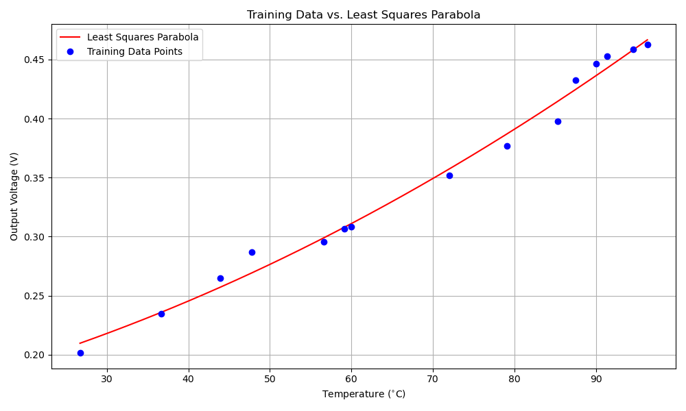

# PT100 Temperature Sensor with Arduino
This project builds an accurate digital thermometer using a PT100 sensor, a high-precision ADS1115 ADC, and an Arduino. The final temperature is displayed on a 16x2 LCD.

## Hardware
* Arduino Uno
* ADS1115 16-bit ADC
* PT100 RTD Sensor
* 100&Omega Precision Resistor
* 4k&Omega
* JHD 162A (16x2) Parallel LCD
* 22k&Omega Potentiometer
* Breadboard & Jumper Wires

## Circuit
The circuit uses a voltage divider (100$\Omega$ resistor and PT100). The ADS1115 measures the voltage from this divider to calculate the sensor's resistance.

## Software
The project runs on the Arduino (`code.cpp`). You will need to install the following library:
* `Adafruit ADS1X15` (from the Arduino Library Manager)

## Calibration
The sensor is calibrated using a quadratic equation (`V = aT^2 + bT + c`) because the PT100's response is not perfectly linear.
* `codes/linear_regression/lsq.py` is the Python script used to find the equation's coefficients.
* `tables/training_data.txt` contains the data used to train the model.
* `tables/validation_data.txt` contains separate data used to test the model's accuracy.

The Arduino code uses the coefficients from this script to convert the measured voltage into an accurate temperature.

### Training & Validation Plots

